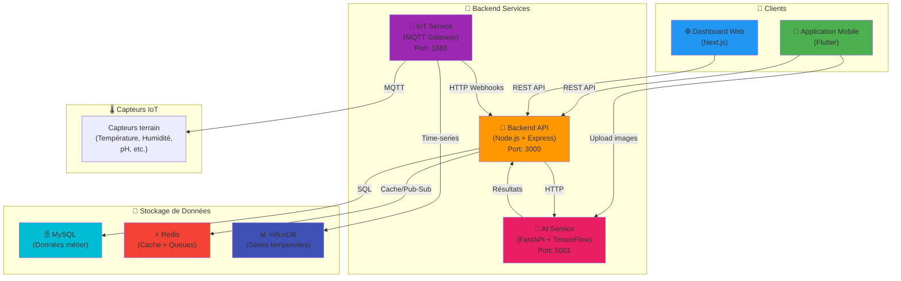

# 🌾 Agrosmart CI - Plateforme Agricole Intelligente

[](https://github.com/amalamanemmanueljeandavid/agriculture)
[](https://opensource.org/licenses/MIT)

> **Système Agricole Intelligent pour améliorer la productivité agricole en Côte d'Ivoire**

## 📋 Description

Agrosmart CI est une plateforme complète d'agriculture de précision conçue pour les producteurs agricoles de Côte d'Ivoire. Elle combine IoT, IA et interfaces mobiles/web pour optimiser les rendements.

## 🏗️ Architecture

Agrosmart CI est une plateforme composée de 5 micro-services interconnectés :



### Composants Principaux

- **Mobile (Flutter)** : Application pour les producteurs (Français, Baoulé, Malinké).
- **Frontend (Next.js)** : Dashboard d'administration et de supervision.
- **Backend (Node.js)** : API REST, WebSocket, et logique métier.
- **IoT Service** : Gateway MQTT pour les capteurs.
- **AI Service** : Détection de maladies par vision par ordinateur.

## 🐳 Démarrage Rapide (Docker)

**Docker Compose** orchestre l'ensemble de la plateforme (5 micro-services + 4 bases de données).

### Démarrer la stack complète

```bash
# 1. Cloner le repository
git clone <repository-url>
cd agriculture

# 2. Copier le fichier .env
cp .env.example .env

# 3. Lancer tous les services
docker-compose up -d

# 4. Vérifier le statut
docker-compose ps

# 5. Voir les logs
docker-compose logs -f
```

### Services Exposés

| Service | URL | Port |
|---------|-----|------|
| 🌐 **Frontend Web** | <http://localhost:3001> | 3001 |
| 🚀 **Backend API** | <http://localhost:3000/api/v1> | 3000 |
| 🧠 **AI Service** | <http://localhost:5001> | 5001 |
| 📡 **IoT Service** | <http://localhost:4000> | 4000 |
| 🗄️ **MySQL** | localhost:3306 | 3306 |
| ⚡ **Redis** | localhost:6379 | 6379 |
| 📊 **InfluxDB** | <http://localhost:8086> | 8086 |
| 🔧 **PhpMyAdmin** | <http://localhost:8080> | 8080 |
| 📡 **MQTT Broker** | mqtt://localhost:1883 | 1883 |

### Commandes Utiles

```bash
# Arrêter tous les services
docker-compose down

# Rebuild après modifications
docker-compose up -d --build

# Voir les logs d'un service spécifique
docker-compose logs -f api        # Backend
docker-compose logs -f frontend   # Frontend
docker-compose logs -f ai_service # AI

# Redémarrer un service
docker-compose restart api

# Exécuter une commande dans un container
docker-compose exec api npm run db:migrate

# Nettoyer (⚠️ supprime les données)
docker-compose down -v
```

## 📚 Documentation

Chaque micro-service possède sa propre documentation détaillée :

- [Backend Documentation](backend/README.md)
- [Frontend Documentation](frontend/README.md)
- [Mobile Documentation](mobile/README.md)
- [IoT Service Documentation](iot_service/README.md)
- [AI Service Documentation](ai_service/README.md)

## 📞 Support

Pour toute assistance, contactez l'équipe technique AgriSmart CI.
