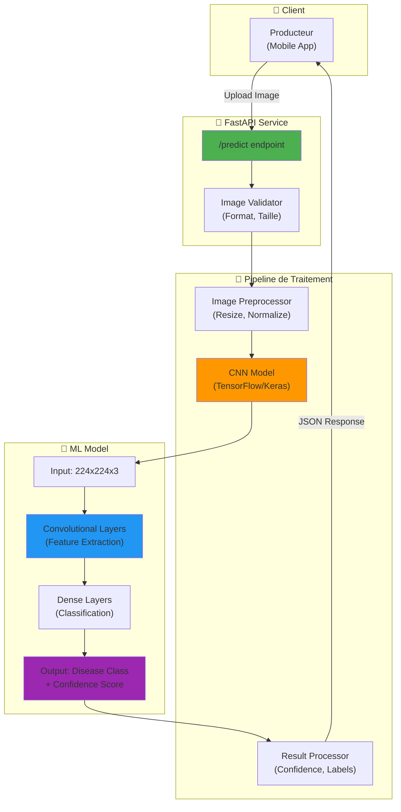

# 🧠 AgriSmart CI - AI Service

Service de détection de maladies des plantes par vision par ordinateur.

## 🛠️ Stack Technique

- **Python** 3.11
- **FastAPI**
- **TensorFlow / Keras**

## 🏗️ Architecture

Le service IA utilise un modèle CNN (Convolutional Neural Network) pour détecter les maladies des plantes :



### Classes de Maladies Détectées

- Mildiou (Late Blight)
- Taches foliaires (Leaf Spot)
- Rouille (Rust)
- Mosaïque (Mosaic Virus)
- Plante saine (Healthy)

## 🐳 Docker (Recommandé)

Le service IA fait partie de la stack Docker Compose :

```bash
# Depuis la racine du projet
docker-compose up -d

# Voir les logs du service IA
docker-compose logs -f ai_service

# Redémarrer le service IA
docker-compose restart ai_service

# Rebuild après modifications de modèle
docker-compose up -d --build ai_service
```

### Build standalone (optionnel)

```bash
# Depuis le dossier ai_service
docker build -t agrismart-ai .
docker run -p 5001:5001 agrismart-ai
```

## 🚀 Utilisation

Le service expose une API REST sur le port **5001**.

- **Health Check**: `GET /health`
- **Prédiction**: `POST /predict` (Multipart file upload)

### Exemple de requête

```bash
curl -X POST http://localhost:5001/predict \
  -F "file=@plant_image.jpg"
```
