# 🌾 AgriSmart CI - Backend API

API REST et WebSocket pour la plateforme AgriSmart.

## 🛠️ Stack Technique

- **Node.js** v20
- **Express**
- **Prisma** (ORM)
- **MySQL** (Base de données)
- **Redis** (Cache & Queues)

## 🏗️ Architecture

Le backend suit une architecture en couches (Layered Architecture) avec séparation des responsabilités :

```mermaid
graph TB
    subgraph Client["🌐 Clients"]
        MobileApp["📱 Mobile App"]
        WebApp["💻 Web App"]
        IoTGateway["📡 IoT Gateway"]
    end

    subgraph Middleware["🔐 Middleware Layer"]
        Auth["authenticate<br/>(JWT Validation)"]
        RBAC["authorize<br/>(Role-Based Access)"]
        Validate["validation<br/>(express-validator)"]
        RateLimit["rateLimit<br/>(DDoS Protection)"]
        ErrorHandler["errorHandler<br/>(Global Error Handling)"]
    end

    subgraph Routes["🛣️ Routes Layer"]
        AuthRoutes["/api/v1/auth"]
        UserRoutes["/api/v1/users"]
        SensorRoutes["/api/v1/sensors"]
        AnalyticsRoutes["/api/v1/analytics"]
        OrderRoutes["/api/v1/orders"]
    end

    subgraph Controllers["🎮 Controller Layer"]
        AuthCtrl["authController"]
        UserCtrl["userController"]
        SensorCtrl["sensorController"]
        AnalyticsCtrl["analyticsController"]
        OrderCtrl["orderController"]
    end

    subgraph Services["⚙️ Service Layer"]
        AuthService["authService<br/>(Business Logic)"]
        UserService["userService<br/>(Business Logic)"]
        SensorService["sensorService<br/>(Business Logic)"]
        NotifService["notificationService"]
    end

    subgraph Data["💾 Data Layer"]
        Prisma["Prisma ORM"]
        MySQL["MySQL Database"]
        Redis["Redis Cache"]
    end

    Client --> Middleware
    Middleware --> Routes
    Routes --> Controllers
    Controllers --> Services
    Services --> Prisma
    Prisma --> MySQL
    Services --> Redis

    style Auth fill:#4CAF50
    style RBAC fill:#FF9800
    style Validate fill:#2196F3
    style ErrorHandler fill:#F44336
```



### Structure des Dossiers

```text
backend/
├── src/
│   ├── config/           # Configuration (DB, Redis, JWT)
│   ├── controllers/      # Logique de contrôle HTTP
│   ├── middlewares/      # Auth, RBAC, Validation, Errors
│   ├── routes/           # Définition des endpoints
│   ├── services/         # Logique métier
│   ├── utils/            # Helpers et utilitaires
│   └── server.js         # Point d'entrée
├── prisma/
│   ├── schema.prisma     # Modèle de données
│   └── migrations/       # Migrations DB
└── tests/                # Tests unitaires et E2E
```

## � Docker (Recommandé)

Le backend fait partie de la stack Docker Compose. Pour démarrer tous les services :

```bash
# Depuis la racine du projet
docker-compose up -d

# Voir les logs du backend
docker-compose logs -f api

# Redémarrer le backend uniquement
docker-compose restart api

# Rebuild après modifications
docker-compose up -d --build api

# Exécuter les migrations Prisma
docker-compose exec api npm run db:migrate

# Accéder au shell du container
docker-compose exec api sh
```

### Services Exposés

- **API Backend** : <http://localhost:3000>
- **MySQL** : localhost:3306
- **Redis** : localhost:6379
- **PhpMyAdmin** : <http://localhost:8080>

## 🚀 Développement Local (Sans Docker)

```bash
# Installation
npm install

# Démarrage (Dev)
npm run dev

# Tests
npm test

# Base de données (Prisma)
npm run db:migrate  # Appliquer migrations
npm run db:seed     # Peupler la base
```

## 🔐 Authentification

L'API utilise JWT et Refresh Tokens.

- **Register**: `POST /api/v1/auth/register`
- **Login**: `POST /api/v1/auth/login`

## 🧪 Tests

Les tests sont exécutés via Jest.

```bash
npm test
```
