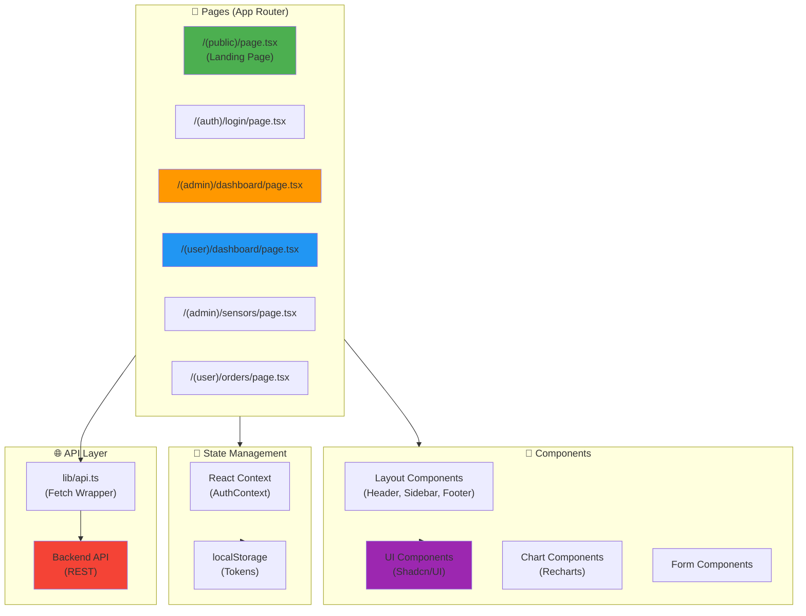

# 🌐 AgroSmart - Frontend Web

Interface d'administration et dashboard utilisateur.

## 🛠️ Stack Technique

- **Next.js** 14 (App Router)
- **TypeScript**
- **TailwindCSS**
- **Shadcn/UI**

## 🏗️ Architecture

Le frontend utilise Next.js 14 avec App Router pour une architecture moderne et performante :



## 🐳 Docker (Recommandé)

Le frontend fait partie de la stack Docker Compose. Pour démarrer tous les services :

```bash
# Depuis la racine du projet
docker-compose up -d

# Voir les logs du frontend
docker-compose logs -f frontend

# Redémarrer le frontend uniquement
docker-compose restart frontend

# Rebuild après modifications
docker-compose up -d --build frontend

# Accéder au shell du container
docker-compose exec frontend sh
```

### URL d'accès

- **Frontend Web** : <http://localhost:3001>
- **Backend API** : <http://localhost:3000>

## 🚀 Développement Local (Sans Docker)

```bash
# Installation
npm install

# Démarrage (Dev)
npm run dev
# URL: http://localhost:3001

# Build (Prod)
npm run build
npm start
```

## 📁 Structure

- `app/` : Pages et routing (Next.js App Router)
- `components/` : Composants UI réutilisables
- `lib/` : Utilitaires et clients API
