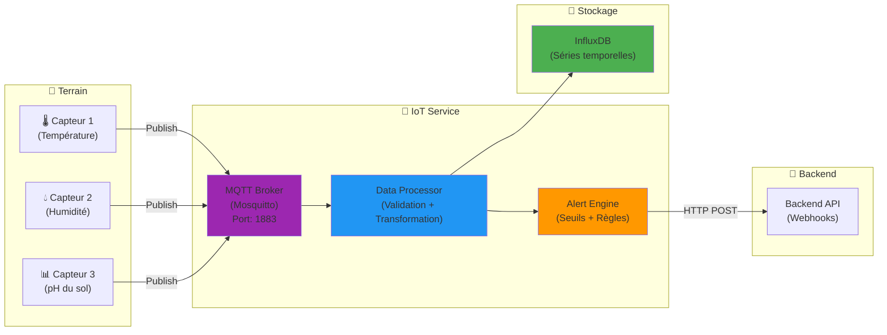

# 📡 AgriSmart CI - IoT Service

Gateway pour la collecte et le traitement des données capteurs.

## 🛠️ Stack Technique

- **Node.js**
- **MQTT** (Mosquitto)
- **InfluxDB** (Time-series DB)

## 🏗️ Architecture

Le service IoT agit comme gateway entre les capteurs physiques et le backend :



### Topics MQTT

- `agrosmart/sensors/{sensorId}/temperature`
- `agrosmart/sensors/{sensorId}/humidity`
- `agrosmart/sensors/{sensorId}/soil_ph`
- `agrosmart/sensors/{sensorId}/status`

## 🐳 Docker (Recommandé)

Le service IoT fait partie de la stack Docker Compose :

```bash
# Depuis la racine du projet
docker-compose up -d

# Voir les logs du service IoT
docker-compose logs -f iot_service

# Redémarrer le service IoT
docker-compose restart iot_service

# Vérifier le broker MQTT
docker-compose logs -f mosquitto
```

### Services Connexes

- **MQTT Broker** : localhost:1883
- **InfluxDB** : <http://localhost:8086>
- **IoT Service** : <http://localhost:4000>

## 🚀 Fonctionnement

Ce service écoute les messages MQTT provenant des capteurs physiques, traite les données, et les stocke dans InfluxDB pour une analyse temporelle. Il notifie également le Backend principal via API en cas d'alertes.
