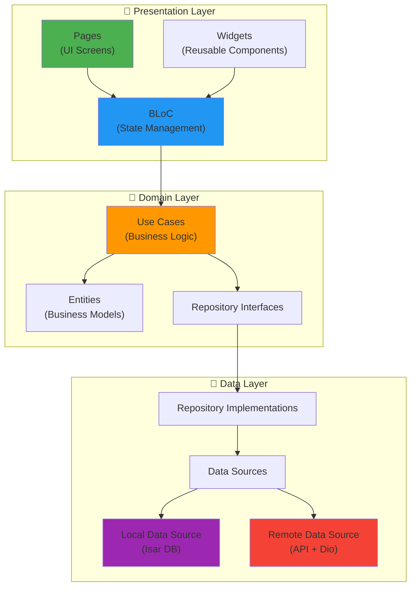

# 📱 AgroSmart - Application Mobile

Application mobile pour les producteurs agricoles.

## 🛠️ Stack Technique

- **Flutter** 3.10+
- **Dart** 3.0+
- **Bloc** (State Management)
- **Isar** (Base de données locale)

## 🏗️ Architecture

L'application mobile suit la **Clean Architecture** avec séparation en 3 couches :



### Fonctionnalités par Feature

```text
lib/features/
├── auth/              # Authentification (Login, Register)
├── home/              # Dashboard principal
├── sensors/           # Gestion des capteurs
├── weather/           # Prévisions météo
├── marketplace/       # E-commerce agricole
├── analytics/         # Statistiques et analyses
├── profile/           # Profil utilisateur
└── settings/          # Paramètres (langue, thème)
```

## 🐳 Backend Docker

**Important** : L'application mobile se connecte au backend qui doit être lancé via Docker Compose :

```bash
# Depuis la racine du projet
docker-compose up -d

# Vérifier que le backend est actif
curl http://localhost:3000/health
```

## 🚀 Commandes Utiles

```bash
# Installation dépendances
flutter pub get

# Génération de code (JSON serializable, Freezed, Isar)
dart run build_runner build --delete-conflicting-outputs

# Lancer l'application
flutter run
```

## 🌍 Configuration Environnement

La configuration API est centralisée dans `lib/core/network/api_client.dart`.

### URLs du Backend

- **Émulateur Android** : `http://10.0.2.2:3000/api/v1`
- **Simulateur iOS** : `http://localhost:3000/api/v1`
- **Appareil physique** : `http://<VOTRE_IP_LOCAL>:3000/api/v1`

Assurez-vous que le backend Docker tourne sur le port 3000.
