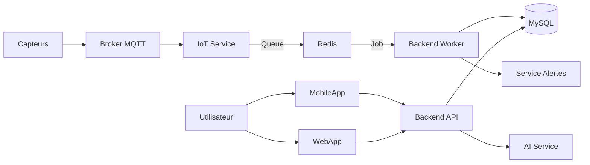

# Analyse Complète du Projet AgriSmart CI

Ce document consigne l'analyse technique et fonctionnelle du projet AgriSmart CI.

## 1. Architecture Globale

Le projet repose sur une architecture micro-services moderne, orchestrée via Docker Compose.

* **Micro-services :** 5 principaux (Mobile, API, Frontend, IoT, AI).
* **Bases de données :** MySQL (Données métier), Redis (Cache & Queues), InfluxDB (Séries temporelles pour IoT).
* **Communication :** REST API (Mobile/Web <-> API), MQTT (Capteurs <-> IoT), Redis Pub/Sub (Inter-services).

### Schéma Simplifié

## 2. Analyse des Composants

### 📱 Application Mobile (Flutter)
Application destinée aux producteurs agricoles.

* **Architecture :** Clean Architecture + BLoC Pattern.
* **Features Clés :**
  * **Authentification :** Inscription multi-étapes, Connexion, Biométrie.
  * **Gestion Parcelles :** Ajout de parcelles, assignation de cultures.
  * **Monitoring :** Visualisation des données capteurs en temps réel.
  * **Diagnostic :** Détection de maladies par photo (via AI Service).
  * **Marketplace :** Vente/Achat de produits.
  * **Offline :** Support complet hors ligne avec synchronisation (Queue).

### 🔧 Backend API (Node.js)
Le cœur du système.

* **Technologies :** Express, Prisma ORM, BullMQ.
* **Rôles :**
  * API REST pour les clients.
  * Traitement asynchrone des données capteurs (Worker).
  * Gestion des alertes et notifications.
  * Gestion de la sécurité (RBAC, JWT).

### 🔌 IoT Service (Node.js)
Passerelle pour les objets connectés.

* **Rôle :** Écoute les topics MQTT (`agrismart/+/up`).
* **Fonctionnement :**
    1. Reçoit le payload JSON du capteur.
    2. Décode les données.
    3. Envoie les données brutes dans une file d'attente Redis (`sensor-data`).
    *Il ne traite pas les données et n'accède pas à la BDD principale, assurant une haute performance.*

### 🧠 AI Service (Python/Flask)
Service d'intelligence artificielle.

* **Endpoints :**
  * `/predict/disease` : Analyse d'image pour détecter maladies (Mildiou, Rouille, etc.).
  * `/predict/irrigation` : Estimation des besoins en eau.
* **Modèles :** TensorFlow/Keras (avec fallback mock si modèles absents).

## 3. Workflow de l'Application (De l'Inscription au Fonctionnement)

### Étape 1 : Inscription Producteur (Mobile)
L'utilisateur télécharge l'application et suit un parcours d'inscription en 3 étapes :
1. **Infos Personnelles :** Nom, Prénoms, Contact, Langue (Français, Baoulé, etc.).
2. **Production :** Définition des types de cultures (ex: Cacao, Maïs) et superficies.
3. **Historique :** Saisie des productions des 3 derniers mois pour initialiser le profil.
*Une fois inscrit, l'utilisateur accède au Dashboard.*

### Étape 2 : Configuration des Parcelles et Capteurs
1. Le producteur crée une **Parcelle** dans l'application.
2. Il associe des **Stations/Capteurs** à cette parcelle.
3. Chaque station physique possède un `device_code` unique.

### Étape 3 : Collecte et Transmission des Données (IoT Workflow)
C'est ici que la magie opère pour les capteurs placés dans les champs.

1. **Capteur (Champ) :** Mesure (Température, Humidité sol, etc.) et envoie un message MQTT.
    * *Topic :* `agrismart/{device_code}/up`
    * *Payload :* `{ "temperature": 28.5, "humidity": 60 }`
2. **IoT Service :** Intercepte le message, l'encapsule dans un Job et le pousse dans Redis.
3. **Backend Worker :**
    * Relève le Job depuis Redis.
    * Identifie la station via le `device_code`.
    * Enregistre chaque mesure dans la table `mesures` de MySQL.
    * **Analyse Immédiate :** Vérifie si la valeur dépasse les seuils (ex: Température > 40°C).

### Étape 4 : Interprétation et Retour Utilisateur
1. **Alertes :** Si un seuil est dépassé, le Worker génère une **Alerte** (ex: "Stress Hydrique Critique").
    * Notification envoyée au mobile.
2. **Visualisation :** L'utilisateur ouvre l'app :
    * L'app appelle l'API (`GET /mesures/latest` ou `/stats`).
    * Les graphiques affichent les courbes de température/humidité.
    * L'IA peut suggérer des actions (ex: "Arroser demain") via l'endpoint irrigation.

Ce flux assure que le producteur est informé en temps réel de l'état de ses cultures, du champ jusqu'à son écran.
